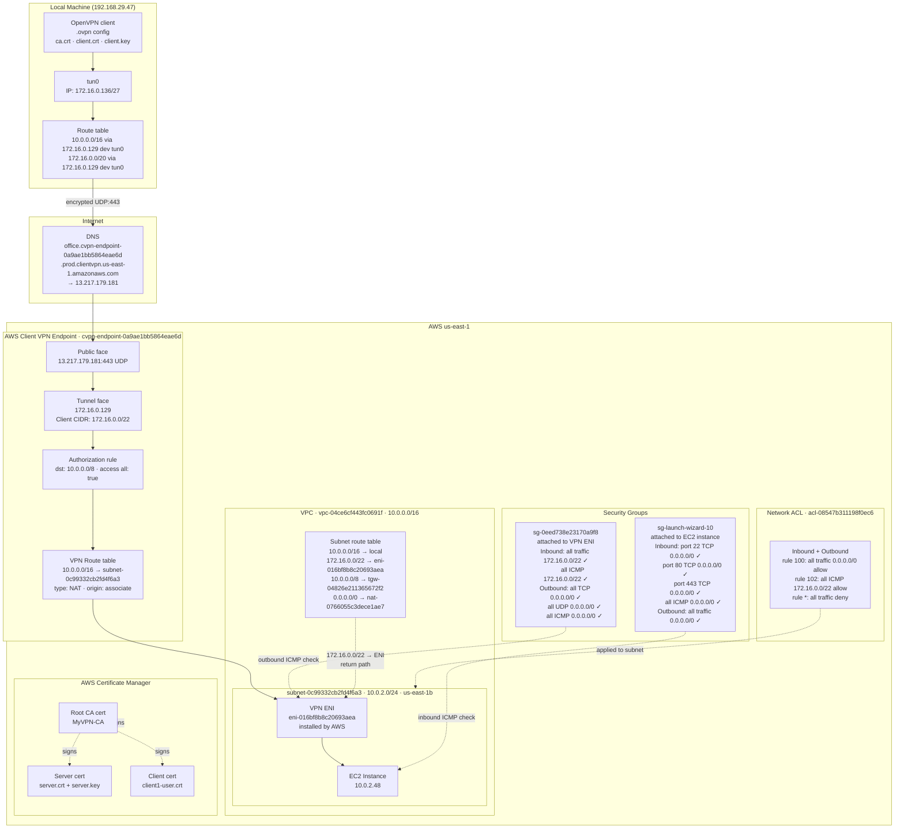

Client VPN endpoint flow:

  1. I have a vpc with a private subnet:
    subnet id: subnet-0c99332cb2fd4f6a3
    i have a single ec2 instance in the private subnet(ec2 private ip: 10.0.2.48)

  2. It starts with mTLS:
    We have a root CA that signs both server and client certificates and keys.
    I created a certificate in aws certificate manager and uploaded the server.crt, server.key and ca.crt files
  
  3. I created a new client vpn endpoint in aws:
    I set the target association to my subnet inside the vpc.
    I have also set up a authorization rule to allow the vpn tunnel to send traffic to the destination CIDR 10.0.0.0/16 (my vpc cidr)
    I also have a route table rule to send traffic from the vpn endpoint id(cvpn-endpoint-0a9ae1bb5864eae6d) to the destination cidr (10.0.0.0/16) to this target subnet: subnet-0c99332cb2fd4f6a3
    So, now when i send traffic to this vpn endpoint from the vpn client running in my local machine to the ec2 instance's priv ip(10.0.2.48) the route table rule sends the packet to the subnet and then to the ec2.
  
  4. I now start the vpn client from my local machine:
    I have a .ovpn file downloaded from the aws console.
    This file contains the DNS of the vpn endpoint that i created in step 3.
    The .ovpn file contains the ca.crt, client.crt and client.key files. Without these 3 files, the mTLS handshake can't happen and the vpn client can't connect to the vpn endpoint.
    This is the vpn endpoint DNS: remote office.cvpn-endpoint-0a9ae1bb5864eae6d.prod.clientvpn.us-east-1.amazonaws.com 443
    For the connection to work, I need to have the following routes in my local machine's route table:
      1. 10.0.0.0/16 via 172.16.0.129 dev tun0 -> this route says that to reach 10.0.0.0/16(my vpc cidr) I have to go through 172.16.0.129 dev tun0
      172.16.0.129: this is the internal/private ip of the vpn endpoint service. Once the vpn client on my machine connects to the vpn endpoint, it can reach this ip(infact this is the internal ip of the vpn endpoint service itself)

      2. 172.16.0.0/20 via 172.16.0.129 dev tun0 -> this is for communication to other ips via the vpn endpoint. So, say if i have another team member who is also connected to the same vpn endpoint,
        then he will also have an ip from this range: 172.16.0.0/20 and i can ping his address through this: 172.16.0.129

  5. when the vpn client is running, if i ping 10.0.2.48 from my local machine, here's the packet flow:
    the kernel routes the packet to 172.16.0.129 because of this routing table rule: 10.0.0.0/16 via 172.16.0.129 dev tun0
    the packet reaches the vpn endpoint -> vpn endpoint sends it to subnet according to the routing table rule -> the subnet has the vpn eni installed by aws(the eni has a security group) -> if icmp outbound rule is allowed in the outgoing rule of the SG, then the packet is sent to the instance with ip 10.0.2.48

------------------------------------
# AWS Client VPN Architecture

## Overview

This document describes the architecture and packet flow of an AWS Client VPN setup that allows a local machine to securely access EC2 instances in a private VPC subnet.

---

## Architecture Diagram

---

## Components

### Local Machine
| Property | Value |
|---|---|
| Physical IP | 192.168.29.47 (wlo1) |
| VPN tunnel interface | tun0 |
| VPN assigned IP | 172.16.0.136/27 |
| VPN tunnel gateway | 172.16.0.129 |

**Local route table (relevant entries)**
| Destination | Via | Interface |
|---|---|---|
| 10.0.0.0/16 | 172.16.0.129 | tun0 |
| 172.16.0.0/20 | 172.16.0.129 | tun0 |
| 172.16.0.128/27 | kernel | tun0 |

---

### mTLS Certificate Chain